## AliDrive-auto-check-in
> 基于[ImYrS/aliyun-auto-signin](https://github.com/ImYrS/aliyun-auto-signin)的自动签到

## 食用指南
---

### 1.  将本项目复制到自己的仓库
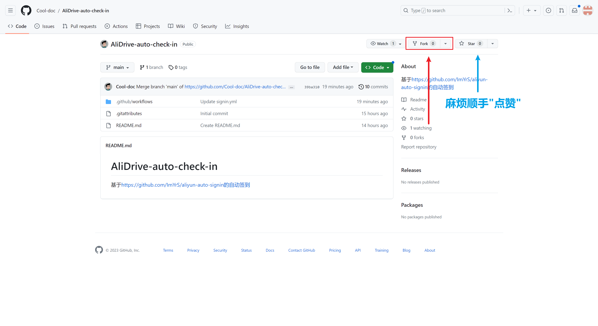
---
### 2.  获取GP_TOKEN
访问：[https://github.com/settings/apps](https://github.com/settings/apps)
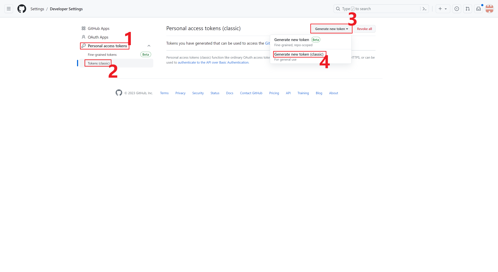
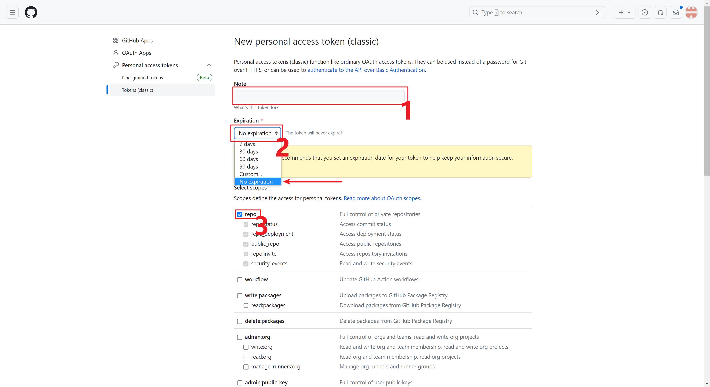
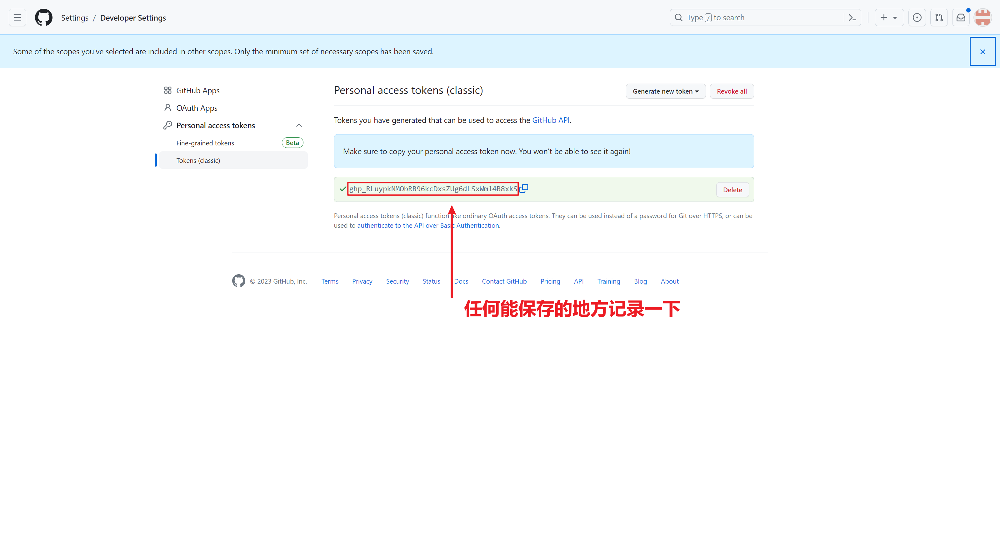
---
### 3.  获取REFRESH_TOKENS
登录阿里云盘网页端，按**F12**，进入**Console**(**控制台**)
粘贴代码：
`JSON.parse(localStorage.token).refresh_token;`
(不需要两端的单引号)

---
### 4.  获取PUSHPLUS_TOKEN
**非必要操作**，每次签到完成后进行微信推送
访问：[https://www.pushplus.plus/](https://www.pushplus.plus/)
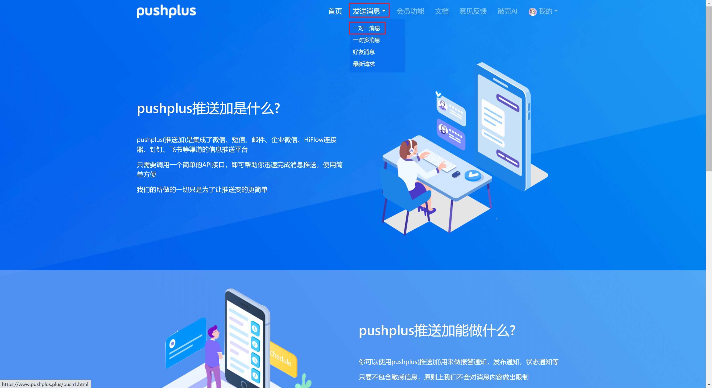
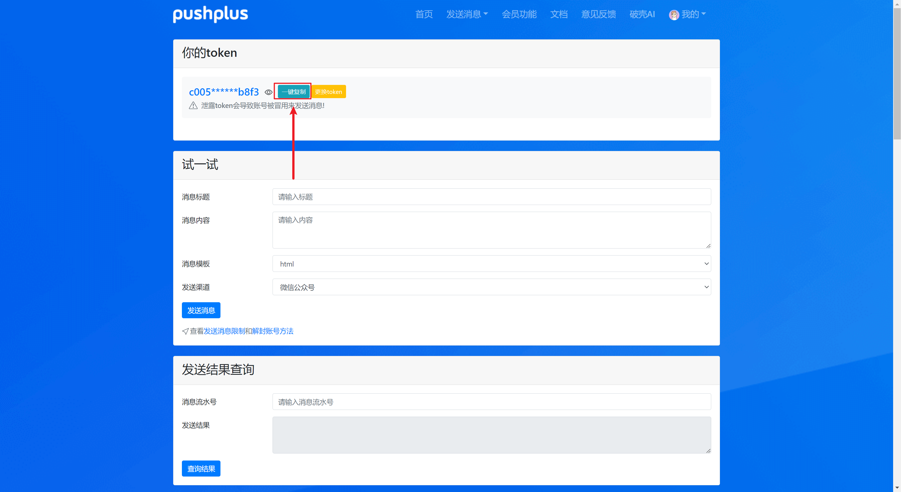
---
### 5.  填写变量参数
回到自己的仓库
分次创建GP_TOKEN、REFRESH_TOKENS、PUSHPLUS_TOKEN，并填入获得的数据 
其中REFRESH_TOKENS可以填入多个值来实现多账户签到，只需要用英文逗号隔开
XXXXXXXXXXXX,XXXXXXXXXXXX
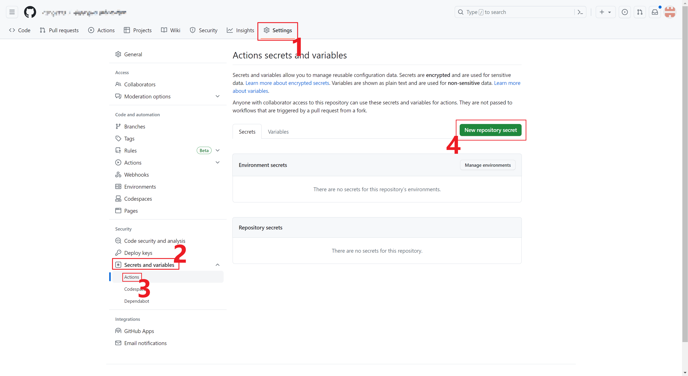
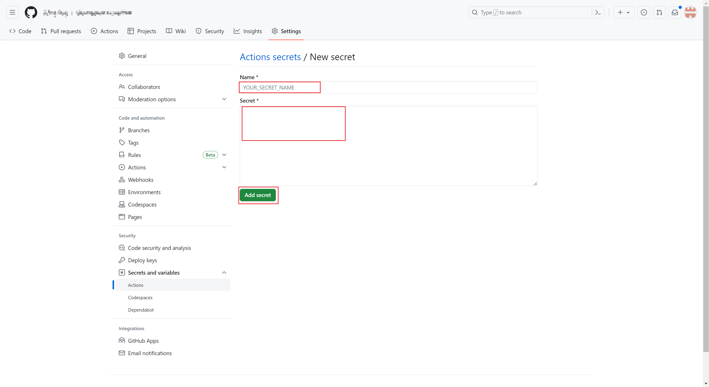
---
### 6.  运行测试
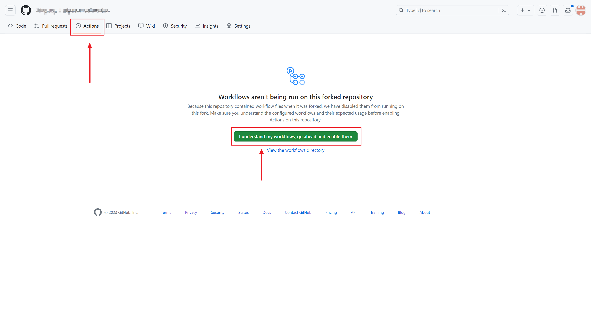
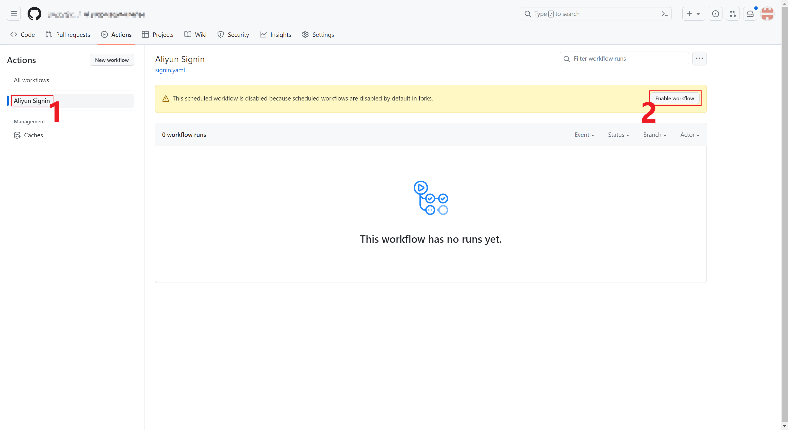
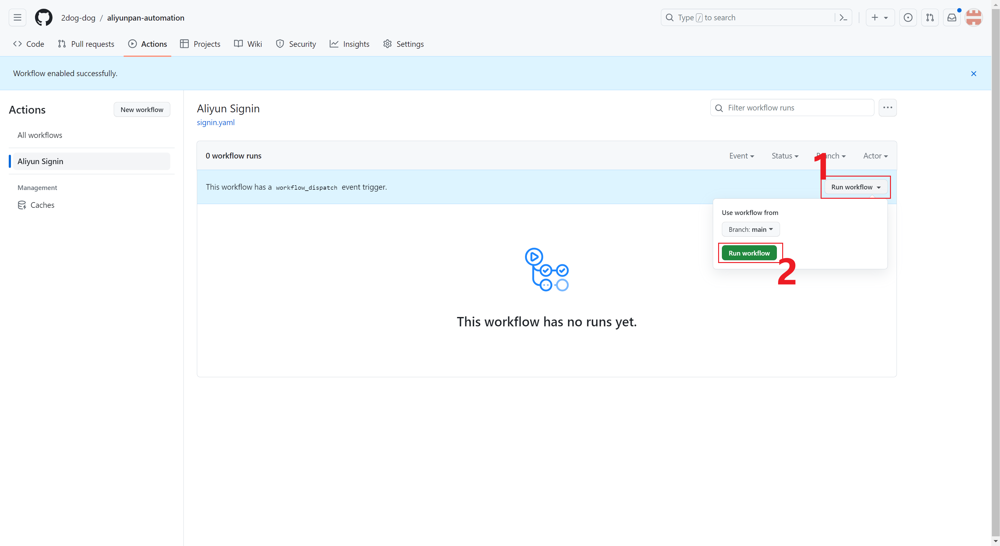
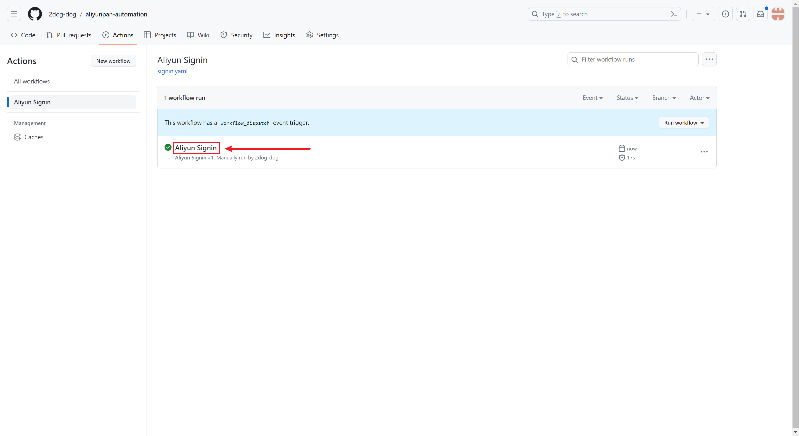
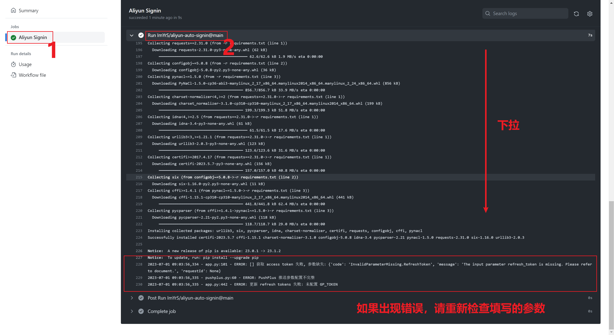
---
### 7.  修改运行时间
进入`.github/workflow/signin.yaml`
默认**北京时间凌晨01：30**，参数为`'30 17 * * *'`，30代表分钟，17代表小时
可修改为想要的时间减8小时，比如我想在北京时间19：30运行，需设置为`'30 11 * * *'`
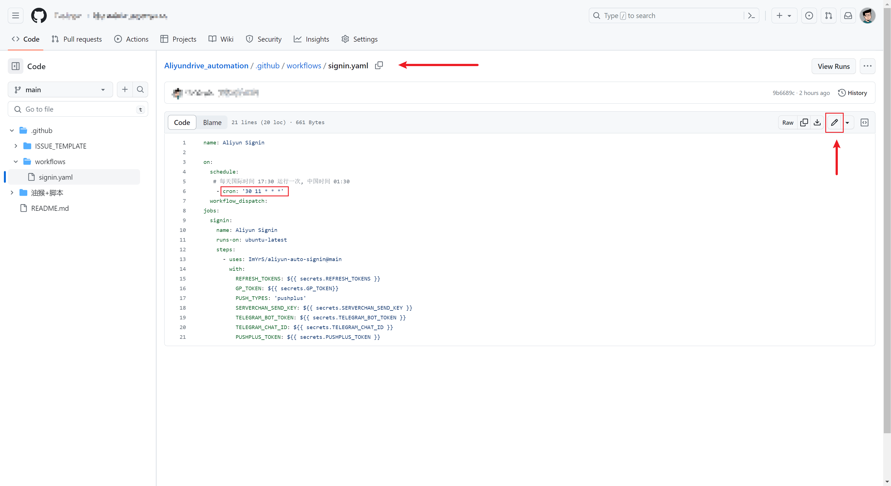
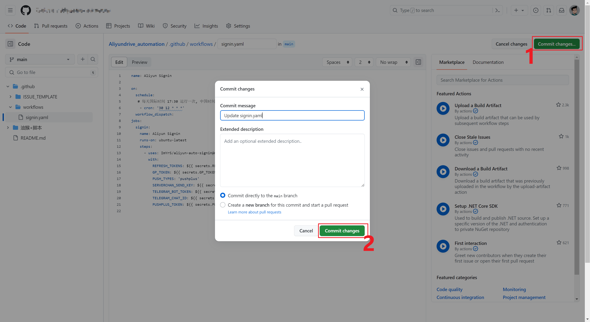
---